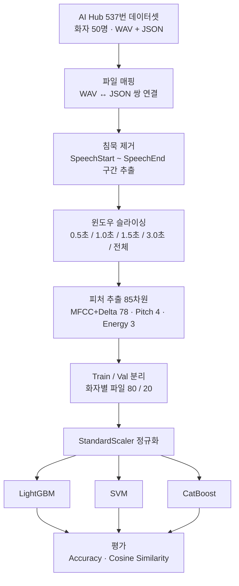
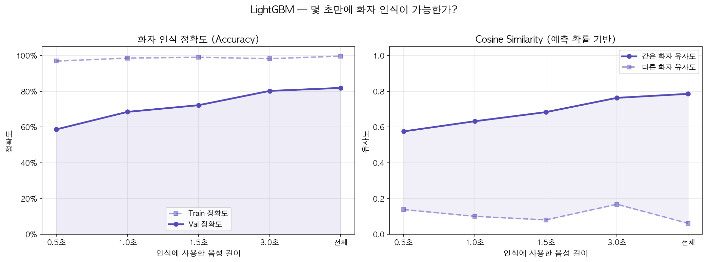
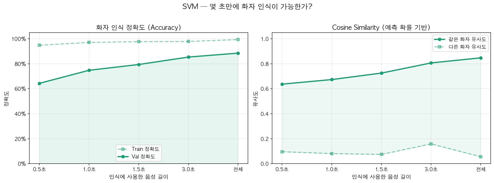
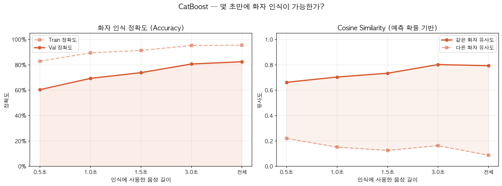
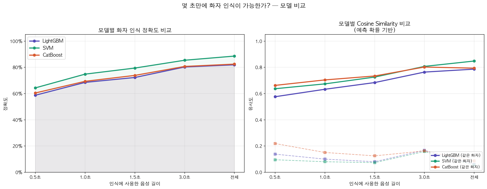

# 음성 시계열 기반 화자 인식 분석 — 오디오 윈도우 길이 및 모델별 성능 비교


## 프로젝트 개요

AI Hub 537번 데이터셋(common 카테고리)을 사용해 화자 50명의 음성 4,835개를 분석합니다.
오디오 세그먼트 길이(0.5초 ~ 전체 발화)를 변수로 삼아 **"얼마나 들어야 누구인지 알 수 있는가"** 를 LightGBM, SVM, CatBoost 세 모델로 검증합니다.

시계열 분석의 **lookback window** 개념을 음성 데이터에 적용한 실험입니다. 주식 분석에서 lookback을 고정하고 미래를 예측하는 것과 달리, 이 프로젝트는 lookback 자체를 변수로 만들어 "얼마나 과거를 봐야 하는가"를 분석합니다.

---

## 파이프라인



---

## 실험 결과

세 모델 모두 음성이 길어질수록 정확도가 꾸준히 올라가는 공통 패턴이 확인됐습니다.

| 음성 길이 | LightGBM | SVM | CatBoost |
|:---------:|:--------:|:---:|:--------:|
| 0.5초     | 58.7%    | 64.4% | 60.5%  |
| 1.0초     | 68.5%    | 74.8% | 69.3%  |
| 1.5초     | 72.3%    | 79.5% | 73.9%  |
| 3.0초     | 80.3%    | 85.4% | 80.7%  |
| 전체 발화 | 81.9%    | **88.6%** | 82.4% |

- **정확도**: SVM이 최고 88.6%로 1위
- **과적합 억제**: CatBoost가 가장 우수
- **균형**: LightGBM이 그 사이

### LightGBM



### SVM



### CatBoost



### 전체 모델 비교



---

## 특징 추출 (85차원)

피처 추출을 3단계에 걸쳐 개선했습니다.

| 단계 | 피처 | 차원 | 검증 정확도 범위 |
|:----:|------|:----:|:--------------:|
| 1차  | 기본 MFCC (평균/분산) | 26 | 41~56% |
| 2차  | + Delta MFCC | 78 | 52~74% |
| 3차  | + Pitch + Energy | **85** | **60~88%** |

**최종 85차원 구성:**

| 특징 | 차원 | 설명 |
|------|:----:|------|
| MFCC + Delta + Delta-Delta | 78 | 13계수 × 3 × (평균 + 표준편차) |
| Pitch (YIN) | 4 | 평균, 표준편차, 최대, 최소 (무성음 제외) |
| RMS Energy | 3 | 평균, 표준편차, 최대 |

Delta MFCC는 프레임 간 변화량(시간적 패턴)을 반영해, 순수 tabular 분류가 아닌 **시계열 분석**으로 만드는 핵심 요소입니다.

---

## 전처리

1. **파일 매핑** — WAV(`TS_common_01`)와 JSON(`TL_common_01`)을 같은 파일명 기준으로 쌍으로 연결
2. **침묵 제거** — JSON의 `SpeechStart` / `SpeechEnd`로 발화 구간만 추출
3. **길이 필터링** — 실험 윈도우보다 짧은 발화 파일 제외
4. **Train / Val 분리** — 화자별 파일을 80/20으로 분리 (50명 전원이 양쪽에 포함)
5. **정규화** — `StandardScaler`로 학습 기준 정규화, 검증은 동일 스케일 적용

**주의**: 화자 단위로 Train/Val을 나누면(화자 40명 학습 / 10명 검증) 학습에 없는 화자를 맞혀야 하므로 정확도가 0%가 됩니다. 파일 기준 분리가 올바른 방법입니다.

---

## 평가 지표

- **Accuracy** — 화자를 정확히 맞힌 비율 (랜덤 기준선: 2%)
- **Cosine Similarity** — 예측 확률 벡터 기반으로 같은 화자끼리는 높게, 다른 화자끼리는 낮게 측정. 음성이 길어질수록 같은 화자 유사도는 올라가고 다른 화자 유사도는 내려가는 패턴 확인

---

## 모델 하이퍼파라미터

| 항목 | LightGBM | SVM | CatBoost |
|------|----------|-----|----------|
| 핵심 파라미터 | n_estimators=100, lr=0.05, max_depth=4, num_leaves=7, L1=1.0, L2=5.0 | kernel=rbf, C=1.0 | 과적합 방지 특화 |
| 전처리 | StandardScaler | StandardScaler | StandardScaler |

---

## 데이터셋

- **출처**: [AI Hub - 자유대화 음성(일반남녀) 537번](https://aihub.or.kr/aihubdata/data/view.do?pageIndex=2&currMenu=115&topMenu=100&srchOneDataTy=DATA004&srchOptnCnd=OPTNCND001&searchKeyword=%EB%8C%80%ED%99%94&srchDetailCnd=DETAILCND001&srchOrder=ORDER001&srchPagePer=20&aihubDataSe=data&dataSetSn=537), common 카테고리 (조용한 실내 환경, 한국인 음성)
- **화자 수**: 50명 / **파일 수**: 4,835개
- **샘플레이트**: 16,000 Hz
- **구조**:

```
New_Sample/
├── 라벨링데이터/TL_common_01/   # JSON 메타데이터
└── 원천데이터/TS_common_01/     # WAV 음성 파일
```

---

## 실행 방법

```bash
source venv/bin/activate
jupyter notebook speaker_recognition.ipynb
```

> VSCode에서 실행 시 커널을 **`Python (speaker_recognition)`** 으로 변경하세요.

---

## 의존성

```
numpy, pandas, librosa, lightgbm, catboost, scikit-learn, matplotlib
```
