# 화자 인식 — 시계열 데이터 분석

> **얼마나 들어야 누구인지 알 수 있는가**
>
> 오디오 세그먼트 길이를 변수로 삼아 음성 데이터의 시계열적 특성을 분석한 프로젝트

---

## 목차

1. [프로젝트 개요](#1-프로젝트-개요)
2. [연구 질문](#2-연구-질문)
3. [데이터셋](#3-데이터셋)
4. [전처리 파이프라인](#4-전처리-파이프라인)
5. [피처 설계](#5-피처-설계)
6. [실험 설계](#6-실험-설계)
7. [모델](#7-모델)
8. [실험 결과](#8-실험-결과)
9. [심화 분석](#9-심화-분석)
10. [결론](#10-결론)
11. [파일 구조](#11-파일-구조)
12. [실행 방법](#12-실행-방법)

---

## 1. 프로젝트 개요

이 프로젝트는 음성을 시계열 데이터로 보고, **오디오 세그먼트 길이(Lookback Window)를 변수로 삼아 "얼마나 들어야 누구인지 알 수 있는가"를 분석**한다.

주식 예측에서 과거 N일치 데이터를 보고 미래를 예측하는 것처럼, 이 프로젝트에서는 과거 N초의 음성을 보고 화자를 예측하는 구조다. 차이점은 Lookback Window 자체를 변수로 만들어 "얼마나 과거를 봐야 하는가"를 분석했다는 점이다.

단순히 화자 인식 정확도를 높이는 것이 목적이 아니라, **시간 정보가 화자 식별에 어떻게 기여하는가**를 피처 레벨과 모델 레벨 양쪽에서 증명하는 것이 핵심이다.

---

## 2. 연구 질문

**메인 질문**

> 오디오 세그먼트가 길어질수록 화자 인식 정확도가 높아지는가? 그렇다면 얼마나 들어야 충분한가?

**세부 질문**

- 짧은 구간(0.3초)에서도 화자 식별이 가능한가?
- 시간 변화량 피처(Delta)가 짧은 윈도우에서 특히 중요한가?
- 이 패턴은 특정 모델에 의존하는가, 데이터 자체의 특성인가?
- 어느 시점부터 추가 정보가 의미없어지는가(정보 포화)?

---

## 3. 데이터셋

| 항목 | 내용 |
|------|------|
| 출처 | AI Hub 537번 — 자유발화 음성 데이터 (common 카테고리) |
| 화자 수 | 50명 |
| 총 파일 수 | 4,835개 (WAV + JSON 쌍) |
| 샘플링 레이트 | 16,000 Hz |
| 녹음 환경 | 조용한 실내 |
| 날짜 폴더 | 2021-12-22, 2021-12-23 |

**발화 길이 분포**

| Percentile | 발화 길이 |
|-----------|---------|
| 10th | 1.47초 |
| 25th | 1.71초 |
| 50th (median) | 2.23초 |
| 75th | 3.06초 |
| 90th | 3.99초 |

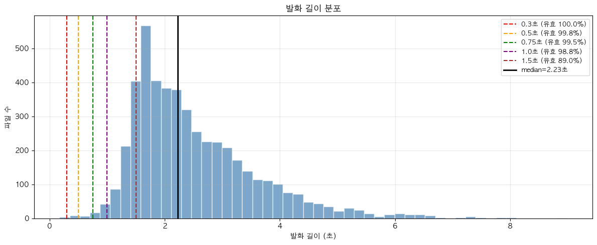

---

## 4. 전처리 파이프라인

기존 전처리 대비 **VAD(Voice Activity Detection) 추가**가 핵심 변경사항이다.

### 4.1 침묵 구간 제거

JSON 파일의 `SpeechStart` ~ `SpeechEnd` 구간만 로드해서 파일 앞뒤의 침묵을 제거한다.

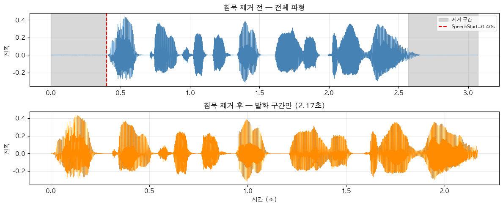

### 4.2 RMS 음량 정규화

화자마다 마이크 거리와 녹음 환경이 달라 음량이 제각각이다. `target_rms=0.1`로 모든 파일의 음량을 동일 기준으로 통일한다.

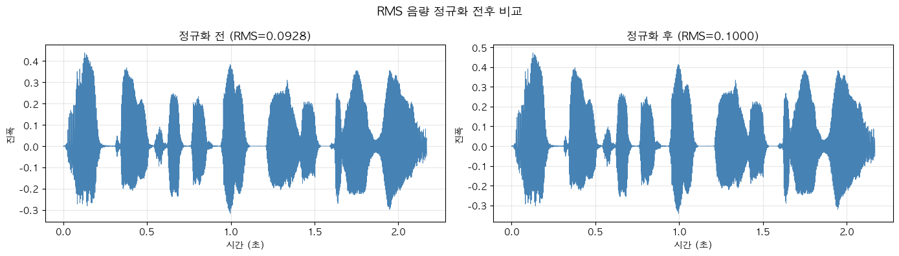

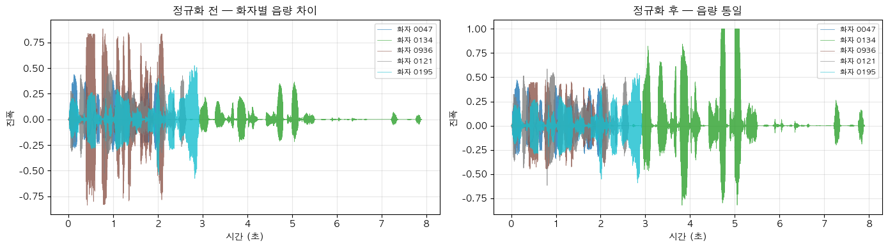

### 4.3 에너지 기반 재트리밍

JSON 레이블 안에도 침묵이 남아있을 수 있다. `librosa.effects.trim(top_db=25)`으로 실제 에너지 기반으로 앞뒤를 한 번 더 다듬는다.

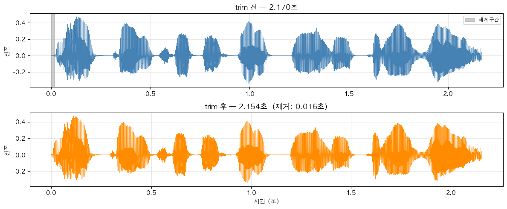

### 4.4 VAD — Voice Activity Detection

발화 중간에 끼어있는 숨소리·짧은 침묵을 30ms 프레임 단위로 감지해서 제거한다. 순수 발화 프레임만 이어붙이기 때문에 같은 0.3초 윈도우라도 실제 발화 정보 밀도가 높아진다.

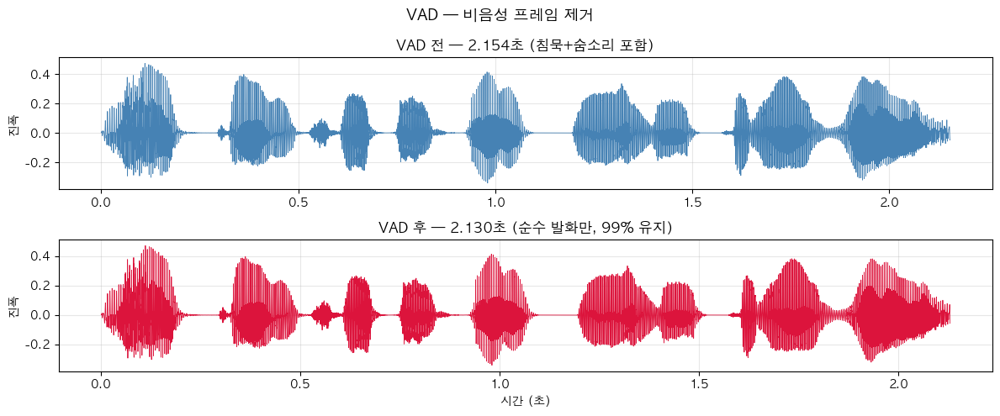

**VAD 효과 검증 (샘플 10개 기준)**

| 원본 길이 | VAD 후 길이 | 유지 비율 |
|---------|-----------|--------|
| 2.17초 | 2.13초 | 98% |
| 4.46초 | 2.58초 | 58% |
| 3.41초 | 2.37초 | 70% |
| 3.25초 | 2.10초 | 65% |
| 평균 | 2.2초 내외 | 65~70% |

긴 발화일수록 침묵이 많이 섞여있어 VAD 효과가 크다.

### 4.5 Pre-emphasis

음성 신호는 물리적으로 저주파에 에너지가 집중된다. `y = y[n] - 0.97 * y[n-1]`으로 고주파 성분을 강조해 MFCC 고계수의 SNR을 높인다.

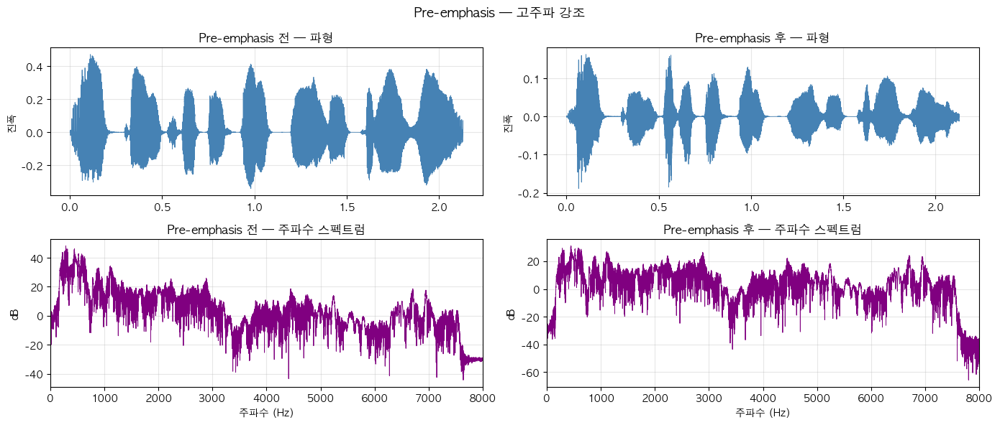

### 4.6 MFCC + Delta + Delta-Delta

MFCC 13계수를 추출하고 CMN으로 환경 차이를 제거한 뒤, Delta(1차 시간 변화량)와 Delta-Delta(2차 시간 변화량)를 계산한다. Delta는 이 프로젝트를 단순 tabular 분류가 아닌 시계열 분석으로 만드는 핵심 피처다.

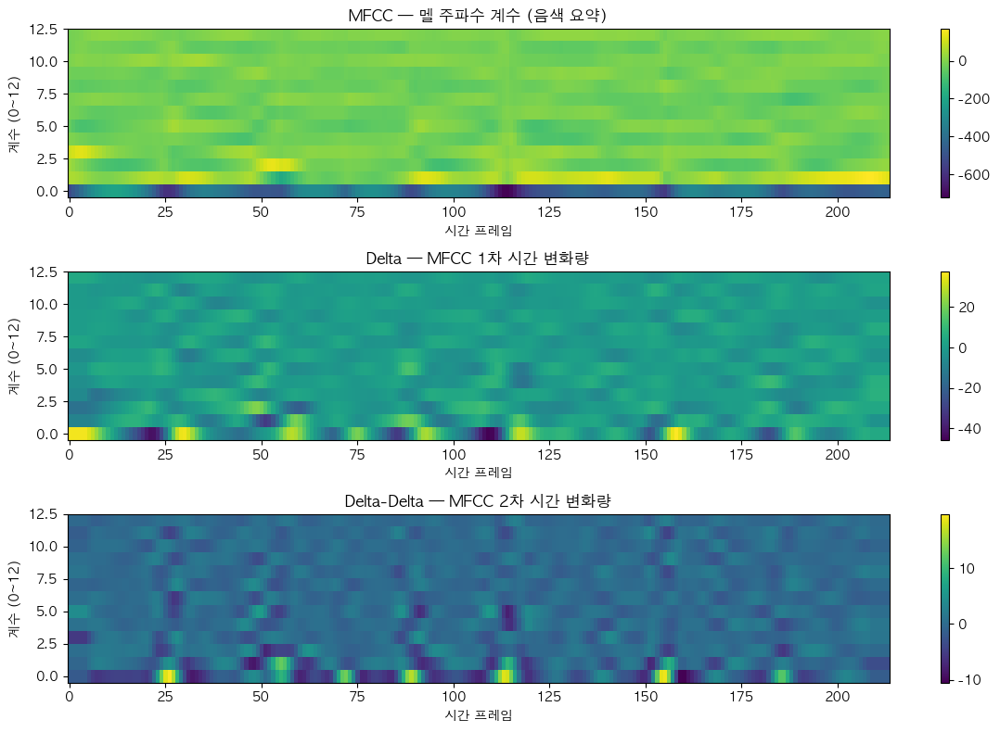

### 4.7 CMN (Cepstral Mean Normalization)

각 MFCC 계수에서 해당 발화의 프레임 평균을 차감한다. 마이크 종류나 방 울림 같은 채널 효과를 제거해 화자 고유 특성만 남기는 화자 인식 분야 표준 전처리다.

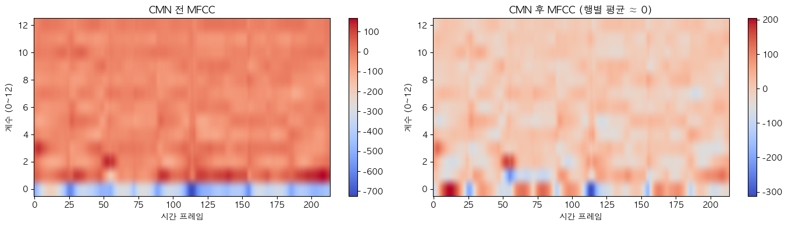

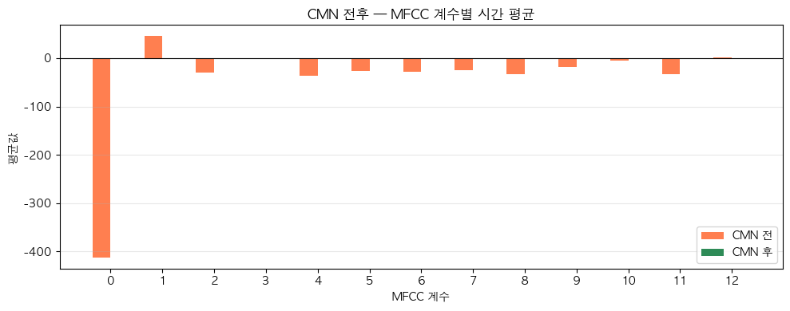

### 4.8 Pitch + Energy

Pitch(YIN, fmin=50Hz, fmax=400Hz)와 RMS Energy를 프레임 단위로 추출한다.

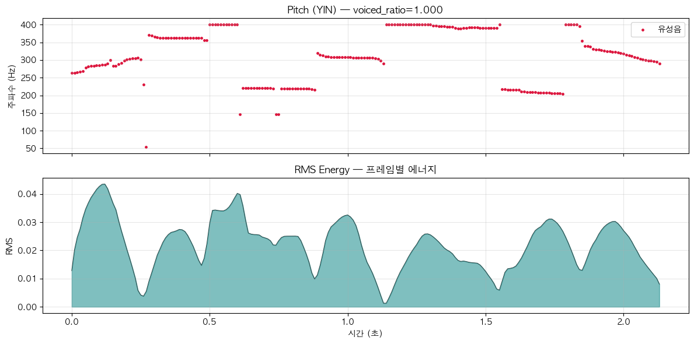

### 4.9 최종 (41, T) 피처 행렬

모든 피처를 이어붙여 (41, T) 행렬로 저장한다. 시간 축(T)을 압축하지 않고 그대로 유지하는 게 기존 전처리와의 핵심 차이다.

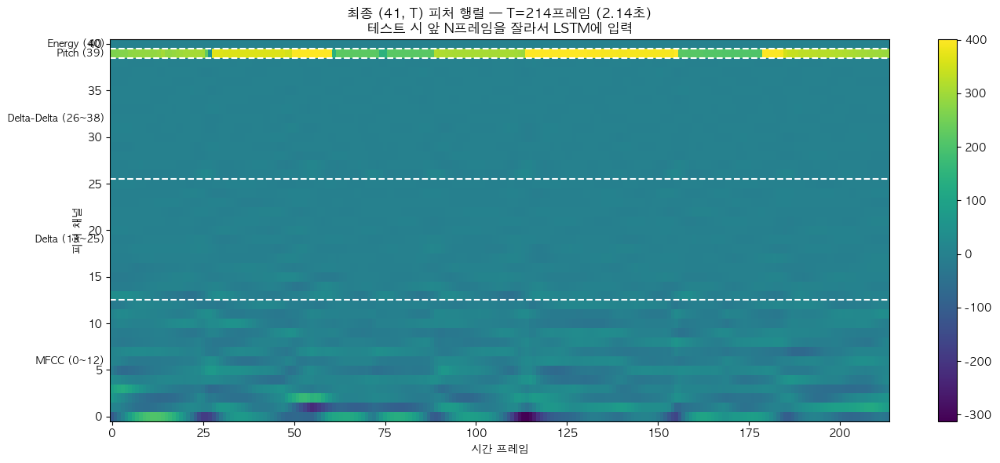

**전처리 파이프라인 요약**

```
WAV 로드
    ↓
JSON SpeechStart~SpeechEnd 구간 추출
    ↓
유효성 검사
    ↓
RMS 음량 정규화 (target_rms=0.1)
    ↓
librosa.effects.trim (top_db=25)
    ↓
VAD — 30ms 프레임 단위 비음성 제거
    ↓
Pre-emphasis (coef=0.97)
    ↓
MFCC(13) → CMN → Delta → Delta-Delta  →  (39, T)
    ↓
Pitch(1, T) + Energy(1, T)
    ↓
(41, T) 행렬로 저장
```

---

## 5. 피처 설계

| 채널 | 피처 | 차원 | 의미 |
|-----|------|-----|------|
| 0~12 | MFCC (CMN 후) | 13 | 각 프레임의 음색 |
| 13~25 | Delta | 13 | 음색의 시간 변화량 (1차 미분) |
| 26~38 | Delta-Delta | 13 | 음색 변화의 가속도 (2차 미분) |
| 39 | Pitch | 1 | 프레임별 음높이 |
| 40 | RMS Energy | 1 | 프레임별 에너지 |

**윈도우별 슬라이싱**

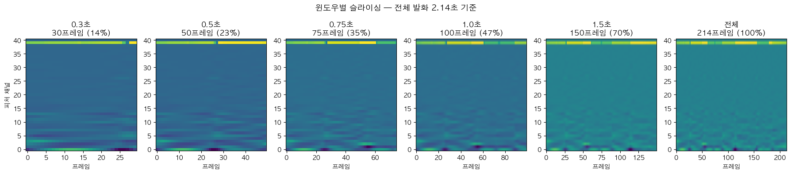

**화자별 피처 패턴 비교**

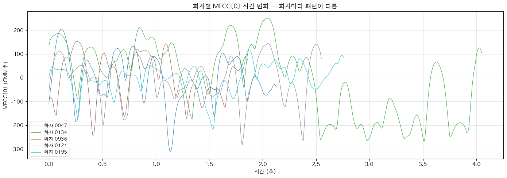

---

## 6. 실험 설계

| 윈도우 | 유효 샘플 (Val) | 선택 이유 |
|-------|-------------|--------|
| 0.3초 | 979 / 980 | 아주 짧은 구간 |
| 0.5초 | 976 / 980 | 기존 프로젝트 최소 단위 |
| 0.75초 | 972 / 980 | 0.5~1.0초 사이 |
| 1.0초 | 965 / 980 | 자연스러운 발화 단위 |
| 1.5초 | 823 / 980 | 25th percentile(1.71초) 근접 |
| 전체 발화 | 980 / 980 | 평균 2.23초 |

> **2.0초를 제외한 이유**: 2.0초 윈도우에서 유효 샘플이 466/980(47%)으로 절반 이하로 떨어진다. 절반 이상이 스킵되면 남은 샘플이 "2초 이상 말한 화자"로 편향되어 공정한 비교가 불가능하다.

각 윈도우마다 동일한 조건으로 독립적으로 학습하고 테스트한다.

```
0.3초 피처로 학습 → 0.3초 피처로 테스트
0.5초 피처로 학습 → 0.5초 피처로 테스트
...
전체 피처로 학습  → 전체 피처로 테스트
```

---

## 7. 모델

| 모델 | 특징 | 선택 이유 |
|-----|------|--------|
| LightGBM | Gradient Boosting | Tabular 데이터 표준 모델 |
| SVM (RBF) | 고차원 경계 분류 | 고차원 피처에서 화자 간 경계 분리에 강점 |
| CatBoost | Boosting, 과적합 억제 | 소규모 데이터에서 안정적 |

세 모델을 사용하는 이유는 **패턴의 일반성** 때문이다. 서로 다른 세 모델에서 동일한 패턴이 나온다면, 그 결과는 특정 모델이 아닌 **데이터 자체의 시계열적 특성**에서 비롯된 것이다.

---

## 8. 실험 결과

### 8.1 윈도우별 정확도

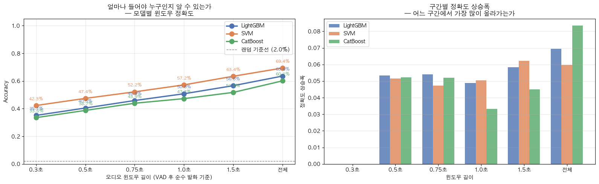

| 윈도우 | LightGBM | SVM | CatBoost |
|-------|---------|-----|---------|
| 0.3초 | 35.1% | **42.3%** | 33.5% |
| 0.5초 | 40.5% | **47.4%** | 38.7% |
| 0.75초 | 45.9% | **52.2%** | 43.9% |
| 1.0초 | 50.8% | **57.2%** | 47.3% |
| 1.5초 | 56.6% | **63.4%** | 51.8% |
| 전체 발화 | 63.6% | **69.4%** | 60.1% |
| 랜덤 기준선 | 2.0% | 2.0% | 2.0% |

세 모델 모두 윈도우가 길어질수록 정확도가 단조 증가. 0.3초에서도 랜덤(2%) 대비 최소 33% 이상으로 짧은 구간도 의미있는 정보를 포함한다.

---

## 9. 심화 분석

### 9.1 피처별 시간 기여도 분석

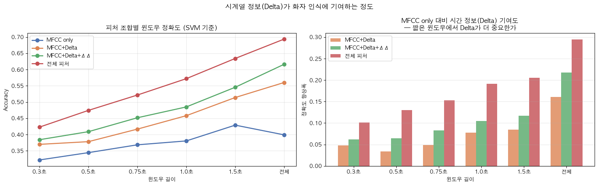

| 피처 조합 | 0.3초 | 0.5초 | 0.75초 | 1.0초 | 1.5초 | 전체 |
|---------|------|------|------|------|------|-----|
| MFCC only | 32.2% | 34.4% | 36.8% | 38.0% | 42.9% | 39.9% |
| MFCC+Delta | 37.0% | 37.8% | 41.7% | 45.8% | 51.4% | 56.0% |
| MFCC+Delta+ΔΔ | 38.4% | 40.9% | 45.2% | 48.5% | 54.6% | 61.6% |
| 전체 피처 | 42.3% | 47.4% | 52.2% | 57.2% | 63.4% | 69.4% |

Delta 추가 시 전체 발화에서 +16.1%p 향상. 특히 **MFCC only는 전체 발화(39.9%)가 1.5초(42.9%)보다 낮다**. 시계열 정보(Delta)가 단순 통계 압축의 한계를 극복하는 핵심임을 보여준다.

### 9.2 Cosine Similarity 분석

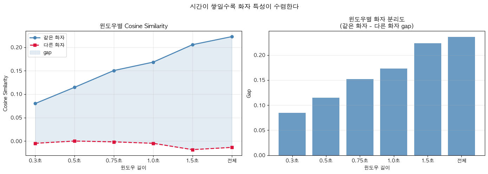

| 윈도우 | 같은 화자 | 다른 화자 | Gap |
|-------|---------|---------|-----|
| 0.3초 | 0.080 | -0.005 | 0.085 |
| 0.5초 | 0.115 | 0.000 | 0.115 |
| 0.75초 | 0.150 | -0.002 | 0.152 |
| 1.0초 | 0.168 | -0.005 | 0.173 |
| 1.5초 | 0.206 | -0.018 | 0.224 |
| 전체 | 0.223 | -0.013 | 0.236 |

모델 없이 피처 벡터만으로도 동일한 패턴 확인. Gap이 0.085 → 0.236으로 2.8배 확대. 이 결과가 특정 모델이 아닌 **데이터 자체의 시계열적 특성**임을 의미한다.

### 9.3 정보량 포화 분석

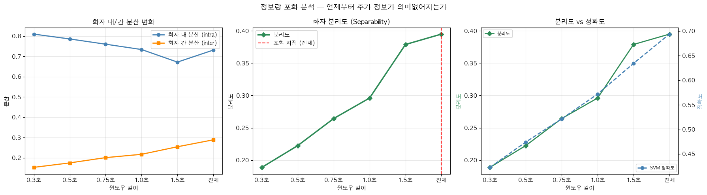

| 윈도우 | 화자 내 분산 (intra) | 화자 간 분산 (inter) | 분리도 (sep) |
|-------|-------------------|-------------------|------------|
| 0.3초 | 0.8101 | 0.1531 | 0.189 |
| 0.5초 | 0.7862 | 0.1751 | 0.223 |
| 0.75초 | 0.7604 | 0.2011 | 0.264 |
| 1.0초 | 0.7342 | 0.2174 | 0.296 |
| 1.5초 | 0.6721 | 0.2546 | 0.379 |
| 전체 | 0.7314 | 0.2888 | 0.395 |

분리도는 1.5초(0.379)에서 전체(0.395)로 완만해지며 수렴에 가까워진다. **"1.5초면 거의 충분하다"** — 이는 SVM 정확도 곡선의 둔화 패턴과 일치한다.

---

## 10. 결론

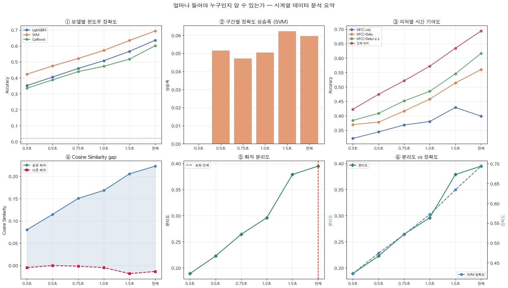

**0.3초**도 랜덤(2%) 대비 42%(SVM)가 나와 의미있는 식별이 가능하다. 그러나 **1.5초가 실용적 임계점**으로, 전체 발화(평균 2.23초) 대비 1.5초에서 이미 91%(63.4% / 69.4%)의 성능에 도달한다.

음성이 시계열 데이터임을 네 가지 관점에서 증명했다.

| 관점 | 근거 |
|-----|------|
| 정확도 | 세 모델 모두 윈도우 길이에 따라 단조 증가 |
| 피처 기여도 | Delta(시간 변화량) 추가 시 +16.1%p 향상 |
| Cosine Similarity | 모델 없이 피처 레벨에서도 동일 패턴 확인 |
| 정보 포화 | 분리도 수렴 지점과 정확도 수렴 지점 일치 |

---

## 11. 파일 구조

```
speaker_recognition/
├── speaker_recognition_preprocessing_v2.ipynb
├── speaker_recognition_analysis_v3.ipynb
├── README.md
├── images/
│   ├── prep_01_silence_removal.png
│   ├── prep_02_rms_single.png
│   ├── prep_02_rms_multi.png
│   ├── prep_03_trim.png
│   ├── prep_04_vad.png
│   ├── prep_05_preemphasis.png
│   ├── prep_06_mfcc_delta.png
│   ├── prep_07_cmn_heatmap.png
│   ├── prep_07_cmn_bar.png
│   ├── prep_08_pitch_energy.png
│   ├── prep_09_feature_matrix.png
│   ├── prep_10_window_slicing.png
│   ├── prep_11_duration_dist.png
│   ├── prep_12_speaker_pattern.png
│   ├── window_accuracy.png
│   ├── feature_contribution.png
│   ├── cosine_similarity.png
│   ├── saturation_analysis.png
│   └── summary.png
└── outputs/
    └── sequences/
        ├── train/
        ├── val/
        ├── labels_train.npy
        ├── labels_val.npy
        └── speaker_to_label.json
```

---

## 12. 실행 방법

```bash
pip install librosa webrtcvad numpy matplotlib scikit-learn lightgbm catboost
```

`speaker_recognition_preprocessing_v2.ipynb` → `speaker_recognition_analysis_v3.ipynb` 순서로 실행. 두 파일 모두 상단 `BASE` 경로를 수정한 후 실행한다.

```python
BASE = "/path/to/New_Sample"
```

---

## 참고

- AI Hub 537번 데이터셋: https://aihub.or.kr
- librosa: 음성 피처 추출
- webrtcvad: Voice Activity Detection
- Delta MFCC: Furui, S. (1986)
- CMN: Atal, B.S. (1974)
